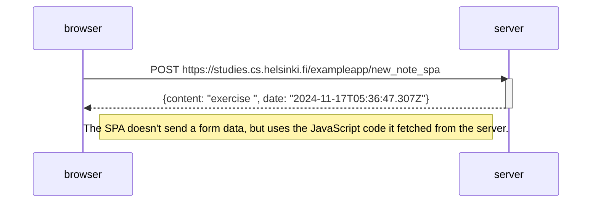

```mermaid
sequenceDiagram
    participant browser
    participant server

    browser->>server: POST https://studies.cs.helsinki.fi/exampleapp/new_note_spa
    activate server
    server-->>browser: {content: "exercise ", date: "2024-11-17T05:36:47.307Z"}
    deactivate server

    Note right of browser: The SPA doesn't send a form data, but uses the JavaScript code it fetched from the server.

```
